# 🎓 Student Result Management System

A Java-based Student Result Management System developed using **Java, JDBC, and MySQL**. The application enables efficient management of student records, academic results, report card generation, and performance analytics through a menu-driven console interface.

---

## 🚀 Features

### 👨‍🎓 Student Management
- Add Student
- View All Students
- Search Student by Roll Number
- Update Student Details
- Delete Student

### 📊 Result Management
- Add Student Result
- View All Results
- Search Result by Roll Number
- Update Student Result
- Automatic Percentage Calculation
- Automatic Grade Calculation

### 📈 Statistics Dashboard
- Total Students
- Average Percentage
- Topper Details
- Lowest Scorer Details
- Passed Students Count
- Failed Students Count

### 📄 Report Card Generation
- Generate Student Report Card
- Save Report Card as Text File
- Display Report Card in Console

---

## 🛠️ Technologies Used

- Java
- JDBC (Java Database Connectivity)
- MySQL
- SQL
- IntelliJ IDEA
- File Handling
- Object-Oriented Programming (OOP)

---

## 📂 Project Structure

```text
StudentResultManagementSystem/
│
├── src/
│   ├── DBConnection.java
│   ├── Main.java
│   ├── StudentDAO.java
│   └── ResultDAO.java
│
├── database/
│   └── student_result_db.sql
│
├── ReportCards/
│   └── Sample_Report_Card.txt
│
├── screenshots/
│   ├── Add_Result.png
│   ├── Add_Student.png
│   ├── Delete_Student.png
│   ├── Generate_Report_Card.png
│   ├── Main_Menu.png
│   ├── Sample_Report_Card_Output.png
│   ├── Search_Result.png
│   ├── Search_Student.png
│   ├── Statistics_Dashboard.png
│   ├── Update_Result.png
│   ├── Update_Student.png
│   ├── View_All_Results.png
│   └── View_Students.png
│
├── README.md
└── .gitignore
```

---

## 🗄️ Database Schema

### Students Table

```sql
CREATE TABLE students (
    student_id INT PRIMARY KEY AUTO_INCREMENT,
    roll_no VARCHAR(20) UNIQUE NOT NULL,
    name VARCHAR(100) NOT NULL,
    class_name VARCHAR(20),
    section VARCHAR(10)
);
```

### Results Table

```sql
CREATE TABLE results (
    result_id INT PRIMARY KEY AUTO_INCREMENT,
    student_id INT,
    subject1 INT,
    subject2 INT,
    subject3 INT,
    subject4 INT,
    subject5 INT,
    total_marks INT,
    percentage DECIMAL(5,2),
    grade VARCHAR(10),
    FOREIGN KEY (student_id) REFERENCES students(student_id)
);
```

---

## 🎯 Grade Calculation Logic

```text
Percentage >= 90  → A+
Percentage >= 80  → A
Percentage >= 70  → B
Percentage >= 60  → C
Percentage >= 50  → D
Percentage < 50   → Fail
```

---

## 📸 Project Screenshots

### Main Menu

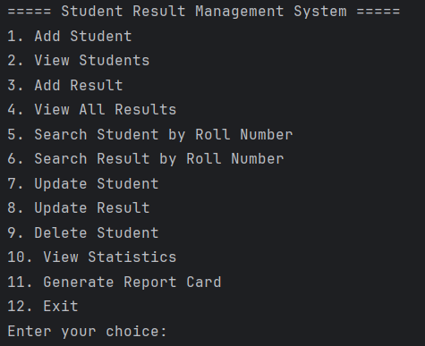

### Add Student

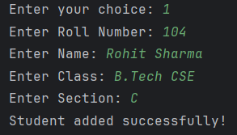

### View Students

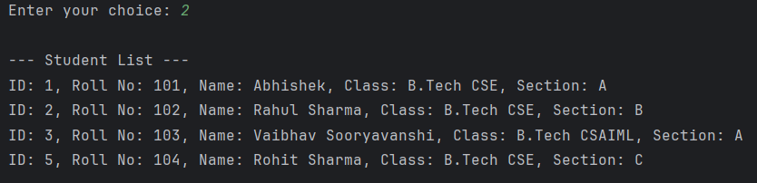

### Add Result

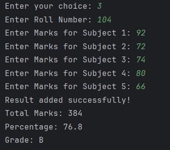

### View All Results

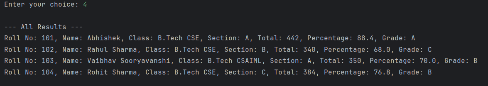

### Search Student

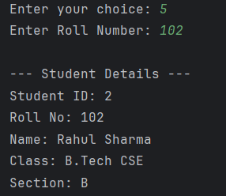

### Search Result

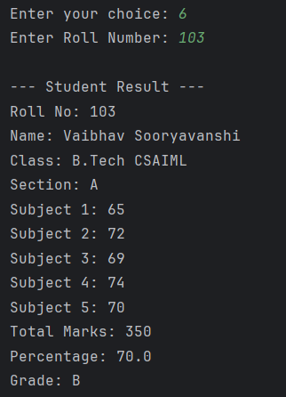

### Update Student

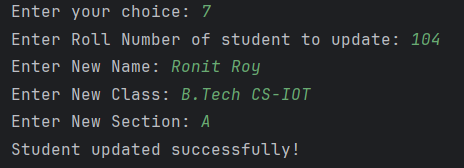

### Update Result

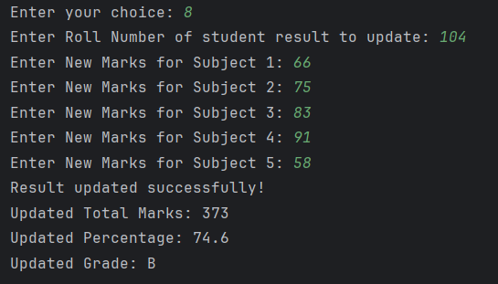

### Delete Student

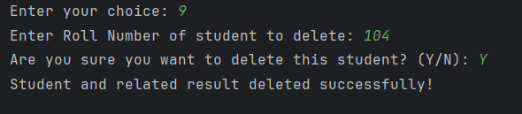

### Statistics Dashboard

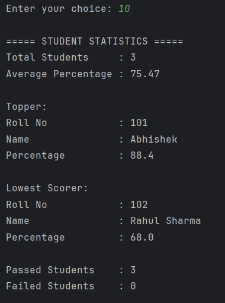

### Generate Report Card

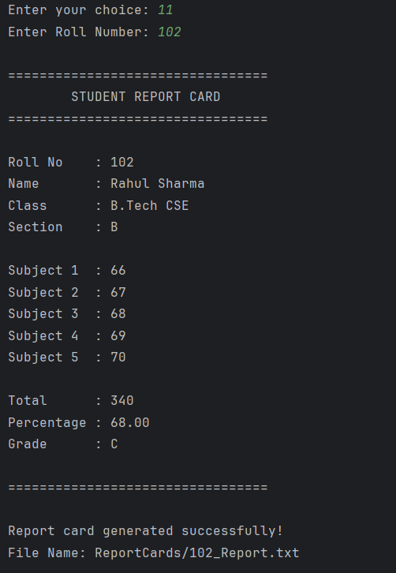

### Sample Report Card

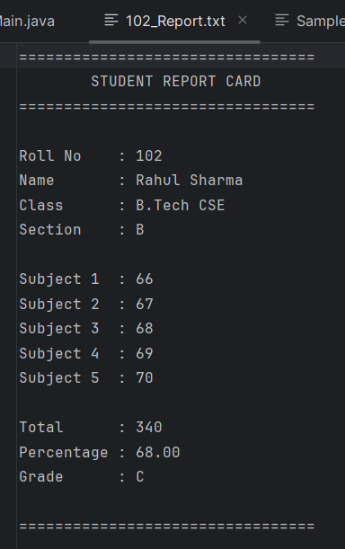

---

## ⚙️ How to Run the Project

### 1. Clone the Repository

```bash
git clone https://github.com/Abhishek-Savita-3012/Student-Result-Management-System.git
```

### 2. Create Database

Open MySQL Workbench and execute:

```sql
database/student_result_db.sql
```

### 3. Configure Database Connection

Update the database credentials in:

```java
DBConnection.java
```

```java
private static final String URL = "jdbc:mysql://localhost:3306/student_result_db";
private static final String USER = "root";
private static final String PASSWORD = "your_password";
```

### 4. Run the Application

Execute:

```java
Main.java
```

---

## 📄 Sample Report Card

A sample generated report card is available in:

```text
ReportCards/Sample_Report_Card.txt
```

---

## 🎓 Learning Outcomes

This project helped in understanding:

- Java Programming
- JDBC Connectivity
- MySQL Database Operations
- CRUD Operations
- SQL Queries and Joins
- SQL Aggregation Functions
- File Handling
- Exception Handling
- Object-Oriented Programming
- Console-Based Application Development

---

## 👨‍💻 Author

**Abhishek Savita**

- GitHub: https://github.com/Abhishek-Savita-3012
- LinkedIn: https://www.linkedin.com/in/abhishek-savita-b41961276

---

⭐ If you found this project useful, consider giving it a star on GitHub.
